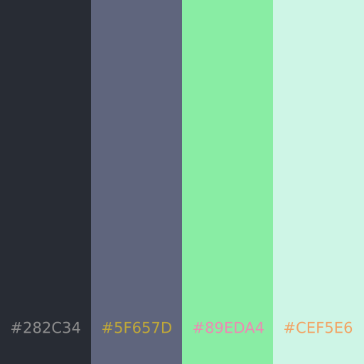

# <strong>Halcyon</strong> : <br/> <em>A Robust Audio API</em>

> <em>Copyright (C) [Jack Meng 2021](mailto://jackmeng0814@gmail.com)</em>

<hr>


<!--
    LICENSED UNDER VENDOR LICENSE
    SEE ./LICENSE

    Notice: This README is entirely
    WORK IN PROGRESS and subject
    to change at any time.

    COPYRIGHT © Jack Meng 2021
-->
<a href="https://halcyoninae.github.io/.github/">

</a>

### <strong><u>Description</u></strong>

> Halcyon is designed to be a lightweight
> and efficient native audio player that
> fits the needs of anyone.

- Features an intuitive API with inbuilt [localization](repo/text/localization.md)
- OpenGL implementation to boost the nature of [Java's Swing Framework](https://jogamp.org/deployment/jogamp-next/javadoc/jogl/javadoc/overview-summary.html)
- Scalable plugin interfaces for [quick plugin development](repo/text/plugin_interfacing.md)

### <strong><u>Features</u></strong>

- Multiple [audio pipelines](repo/text/audio_lineage.md) to choose from and used to play audio efficiently
- Many supported audio formats (and more to be supported)
- Inbuilt Swing extendable (BlurredUILayer, Scalable Frames, etc.) that you can use in your own programs
- OpenGL backing for Swing Frameworks, enabling better performance and better flow control over the GUI wrapper.
- Lightweight image manipulation library (Cosmos / DeImage)

### <strong><u>Supported Formats</u></strong>

<strong>Currently Supporting</strong>

- MP3 (.mp3)
- WAVE (.wav)
- AIFF (.aiff, .aif)
- Vorbis OGG (.ogg, .oga)
- FLAC (.flac)
- AU (.au)
- MP2 & MP1 Layers (.mp2)
- AIFC (.aifc)
- Opus (.opus, .oga)

<details close>
<summary><strong>Soon To Support / Partially Supported</strong></summary>

- AAC
- M4A
- WMA
- RAW
- DSD
- AC3
- M4R
- RA
- APE
- ACC
- MIDI
- SNG
- ACC
- WAVPACK
- TTA
- MPC
</details>
<hr>

## <strong>Why Halcyon?</strong>

<u>GUI Wrapper</u>

Halcyon's GUI program uses both Java Swing & OpenGL to display graphics on screen. However, for the majority, a <code>javax.swing</code> component will be used, with OpenGL used for
much more intensive graphical tasks.

There are many specific adaptations used in the program to get it up to par with much more mainstream GUI frameworks (like HTML/CSS). For example, the GUI blurring is all done via a layer on top of the image and not directly applied to the image, thus saving resources.

Image Manipulation is done via the internal lightweight library Cosmos. It serves as a way to display images to fit the needs of the GUI display.

Note: The internal Swing Components that are created and implemented are not designed to be used outside this program (also known as [localization](repo/text/localization.md)) and can cause unexpected results in your own programs if you are to use this as a library of sorts.

<p align="center">

</p>
<p align="center">
<em>The GUI Wrapper's "Dark Green" color scheme</em>
</p>

<u>Sound API</u>

The Java Sound API is pretty lackluster, and many features surrounding its usage are less user-friendly. Therefore, there are many adaptations and separate implementations by third parties. For example, JavaFX adopted its [MediaPlayer](https://docs.oracle.com/javafx/2/api/javafx/scene/media/MediaPlayer.html) via Java Sound (a wrapper of sorts). Then you also have a feature rich low level implementation of Java Sound, called [Tritonus Sound](https://www.tritonus.org/). However, it might seem correct to go with JavaFX's premade high-level abstraction, but it offers far less control over the ACTUAL audio data being streamed. Thus, we come to Halcyon's Tailwind Audio API (not to be confused with [TailwindCSS](https://tailwindcss.com/)). Tailwind offers a transition and a bridge between these frameworks and adaptations (if available) in a user-friendly and lightweight format. Inside, it offers high level functionalities such as just simple <code>play(file)</code> & <code>pause()</code> functions, but also offering much lower level functions such as <code>normalize(bytes[])</code> <code>read(bytes[])</code> (see the documentation for more).

Halcyon offers a way for users to not have to worry about convoluted low level implementations, meanwhile providing an equal balance between high & low level.

Currently, the Tailwind Framework can work with the following pipelines:

- Java Sound API (Standard Tailwind)
- Tritonus Sound
- JavaFX MediaPlayer (if available)
- MiniAudio (Always provided natively)

<hr>

## <strong>Manifesto</strong>

Halcyon follows a KISS motive for all its abstract APIs:<br>

- **K** - Keep<br>
- **I** - It<br>
- **S** - Simple<br>
- **S** - Scalable<br>

*Disclaimer: not what the original KISS stands for*

SIMPLE: In no way shall the API be developed in a way that an average programmer cannot distinguish the usage/complexity of a low level function with that of a high level function. All API calls should be clear and do as what they are documented to do, without caveats.

SCALABLE: The API is built on the fact that everything can be extended & improved without the need to make an entire new implementation. This includes native calls, linking, and licensing.

<hr>

## <strong>Requests</strong>

Request TYPE are defined as the following:

- Feature Requests
- Issue / Vulnerability Report

<hr>

**<code>[!!]</code> Notice:** It is strongly advised that if you are going to submit any form of requests that you read the more indepth overview in [<code>CONTRIBUTING.md</code>](CONTRIBUTING.md)

<hr>

**How to place a request**

To place a request you simply do so by making a pull request that may or may not modify the original request file in the live branch. The pull request should follow this format for best clarity:

> Urgency|RequestType|#RequestNumber|RequestTitle

- Urgency -> 1 to 3 asteriks (\*) with 3 being the most urgent
- RequestType -> Feature Request OR Issue / Vulnerability Report; this should simplified to <code>FTR</code> OR <code>ISE</code>
- RequestNumber -> The latest number in the live branch's request type file
- RequestTitle -> A short eye catching string that describes your request best

The changes you make in the pull requests are not limited to just the file (meaning you can include your own rework).

### <strong>Request Types</strong>

**[FTR] Feature Request**

Defined in the file [<code>/requests/FEATURES.txt</code>](requests/FEATURES.txt).

Feature requests are placed when someone wants something added to the base build of the final software. These requests can sometimes mention and/or include ISSUE reports within.

**[ISE] Issue Report**

Defined in the file [<code>/requests/ISSUES.txt</code>](requests/BUGS.txt).

Issue Reports are requests that are placed when something isn't working properly. AKA a bug report.

<hr>

## <strong>Packaging</strong>

This program is provided under [this license](LICENSE.txt).

<u>Package Layout</u>

Standard Layout:
<code>
src/
com/
jackmeng/
</code>

- You will find the designated packages regarding the Halcyon project in the dir: <em>halcyoninae</em>

<u>Release Style</u>

Releases will be pushed out in the following formats:

1. **Master Archive**
   - Contains all of the necessary components to almost run crossplatform native libraries altogether in a big archive file
   - Big on size and contains files you may not need on your specific hardware & operating system.
   - Contains a copy of the JavaDocs for this project
   - A sub version of this style is a separate archive per architecture and operating system
2. **Native Binary**
   - An archive file that has its main entrypoint compiled as a native image that is compatible with your operating system and hardware (x86 & x86_64)
   - Contains static & dynamic libraries that are linked during compile time
   - Does not contain a copy of the JavaDocs
   - Any runtime components are provided on demand
   - This packaging style can sometimes not be present in a release
3. **Native Bundle**
   - An archive file that contains a native executable that points to a compiled JRE
   - Similar to a Native Binary
   - Usually bigger in size
   - Static Libraries & Dynamic Libraries linked on demand

<hr>

## <strong>Example</strong>

Playing audio is as simple as initing a `Tailwind` object like so:

```java
/*
 * You don't have to force a pipeline! 
 * The class itself has constructs to determine
 * what to use.
 */
Tailwind player = new Tailwind(); // no parameters are accepted
player.open(new File("some_audio_data.ogg")); // opening the stream
player.play();
```

Check the documentation for more: [Tailwind Docs](https://halcyoninae.github.io/halcyon-docs/com/jackmeng/halcyoninae/tailwind/TailwindPlayer.html)


<hr>

## <strong>Version Info</strong>

This project is the 3rd iteration of a much older project, which you can find [here](https://github.com/Halcyoninae/mp4j-old), so technical version number starts from **3** (rolling iteration). This number will increase by 1 (+1) per every 1 whole iteration in the rolling release number.

<u>Rolling Release:</u> 3.4.1<br>
<u>Rolling Iteration:</u> 3.0<br>
<u>Version Meta:</u> Beta<br>

View Version History [here](VERSION.txt)

<hr>

## <strong>System Requirements</strong>

This is a lightweight program, but there are some things that you need in order to have this program running smoothly. Usual memory usage hovers around 20-30 mB on any load.

**Runtime Requirements**

Entirely based on your provider.

A Native Bundle provides a runtime image based on your specified architecture

- Minimum version: 11
- Minimum Heap: 25 mB

**Client Requirements**

- Proper Sound Card
- CPU: Any that can run Java
- GPU: Any with OpenGL support
- Minimum Memory: 20 mB
- Maximum Memory: 300 mB
- Minimum Hard Storage: 35 mB (dependent on usage w/o automatic cache control)
- Minimum Screen Resolution: None

<hr>

## <strong>Related Resources</strong>

**JavaDocs Documentation** | [Click Here](https://halcyoninae.github.io/halcyon-docs/)

**Project Website** | [Click Here](https://halcyoninae.github.io/.github/)


[](https://www.codacy.com/gh/exoad/Halcyon/dashboard?utm_source=github.com&utm_medium=referral&utm_content=exoad/Halcyon&utm_campaign=Badge_Grade)

</center>

<hr>

> Everything is a work in progress :)

<hr>

<em>Notice anything broken about this README? Submit a PR!</em>
