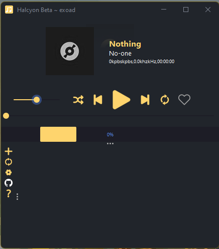
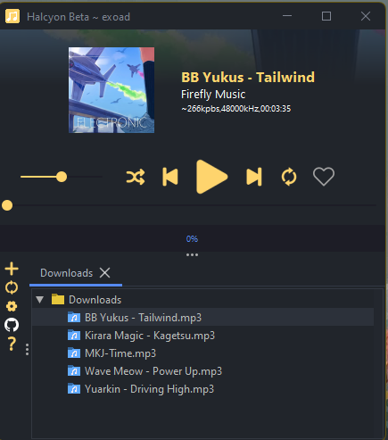

# Halcyon (MP4J 3.0)

   

*Copyright (C) 2021-2022 Halcyon (MP4J) to Jack Meng*

> This is rework of an original project by me [MP4J](https://github.com/Exoad4JVM/mp4j)

This is a music player written in Java with a nice GUI to facilitate your music
playing needs.

> Notice: This is not a guide on how to use the program, instead just a simple README for the main repository. A user-guide markdown document will be created later.

### Version Info
This README is updated for the version: 3.2 [For the program] 
This README's constant version is 3.0 [For the iteration]

This program currently has a lot of features yet to be implemented. And with these new additions also bring a lot of new bugs that needs
fixing!

## Installation

Currently there are no direct pre-compiled binary and executables that I have made
for you to simply download and run. However, you can download this project and run it from source.

It is recommended to have Java 8 or above in order to run this program either from source or
from a pre-compiled binary. Note: Tag for forcing optimizations upon the program may or may not work for
different runtimes, but for my own side I used Corretto-16-JDK, if you feel like it is not doing the correct thing, you may disable this feature.

**Main Class:** `Halcyon` [here](Source/com/jackmeng/halcyon/Halcyon.java) 
*Note there are more than one `main()` functions throughout the program! The above is the class that starts everything and not separate daemons.* 
**Linker Manifest:** `MANIFEST.MF` [here](Source/META-INF/MANIFEST.MF)

## Audio Framework

This program uses a questionable framework that I made / based on. Currently, it is in the stage of optimizations. 

The audio buffer is constantly read (AKA streamed) and then written to a data line. This process is all asynchronous, 
with synchronization methods provided to certain methods. A streamed method allows this player to not have to waste
overhead and memory loading everything into memory and then reading.

Synchronization is only provided for getter methods requiring specific resources from the stream. 

Playlist feature or continuous playing feature must be implemented by the user as a subset of the Tailwind player
or the pre-implemented PlayList class.

The quality of the reading speed is on par; however, the quality may substantially drop when the gain is increased
to the max or substantially.

The Tailwind Player class is a subset of Audio's interface and contains esoteric methods that must be called directed
as a Tailwind player instead of an explicit Audio.

Modification of the audio during runtime either intentional or unintentional, wanted or unwanted as per the license is handled by the user. The user in turn
may file a bug report for this modification or a pull request to fix the issue directly.

## Current

Currently this program is still in development and is not yet ready for consumer usage,
with yet some missing features and bugs. (Check out [BUGS](docs/BUGS.txt) & [FEATURES](docs/FEATURES.txt)).

However, improvements upon it's backend audio framework will be needed in order to introduce newer features to the program.

Optimization wise, the program with the forced optimization feature on uses at most 40mb of memory during audio playback; however, if the forced audio playback feature is turned off, memory consumption can be much higher (<150mb).

## Reading Source Code

Many of the Java Class Files contain JavaDoc comments; however, there are no pre-generated JavaDoc and you must generate them by yourself if you are planning
to view the documentation via the prettified way.

The most common naming for class files and classes in general is with endings of "-Manager". These class files contain runtime constants, that either can be modified or are constants. Changing these constants are like changing the properties file for the program. Furthermore, these properties and values are not commented (bc I don't have time) and you should proceed with caution when changing a value.

In all subclasses for the GUI part of the program, all packages will have either an interface named after the package or a class that designates the usage of the package. For example, package `com.jackmeng.cosmos.components.bottompane` has a container class called `BottomPane` which signifies it is the main entry point into that package. To put it simply, an entry point class is the only thing that is imported during runtime. The Entry Point class handles everything else that is part of the same package. (IDK)

## Contributing

The current state of the repository will not enable the usage of the ISSUEs tab. To contribute, like suggest a feature or report a bug, you must edit the [BUGS](docs/BUGS.txt) OR [FEATURES](docs/FEATURES.txt) files via a pull request. I will then review it from there.

Why you may ask? It is because adding this PR only feature allows me to better look at the issues on my side without having to pull up GitHub or another
Git service every time I want to look at issues.

## Legals

This program uses external libraries and framework, and their attributed licenses
can be found [here](LICENSE.txt).

Any copyright or legals to do with the audio being played is at the expense of the end-user.

## Screenshots
*Note these are not the latest screenshots for the current main branch.* 

