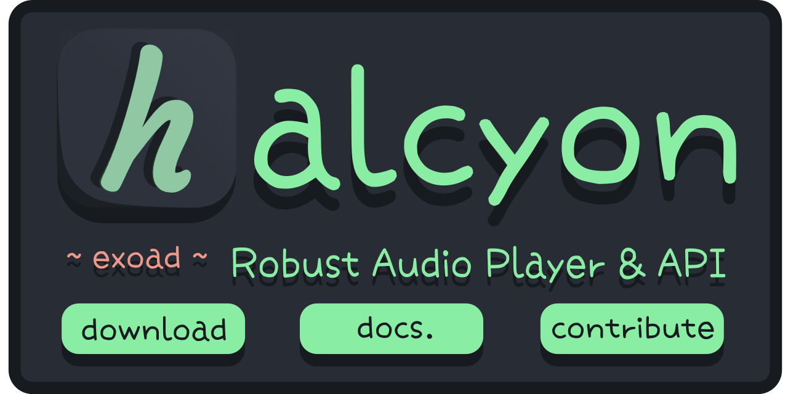
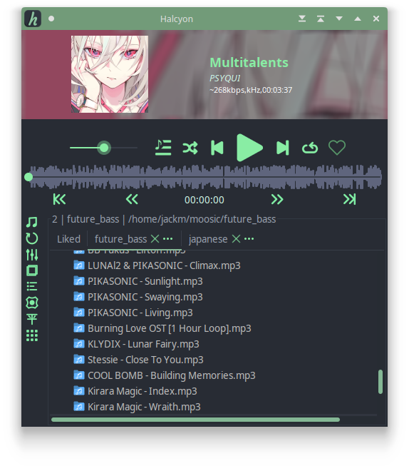

 
# <strong>Halcyon</strong> :   <em>A Robust Audio Player</em>
> <em>Copyright (C) [Jack Meng 2021](mailto://jackmeng0814@gmail.com)</em>

<!--
    LICENSED UNDER VENDOR LICENSE
    SEE ./LICENSE

    Notice: This README is entirely
    WORK IN PROGRESS and subject
    to change at any time.

    COPYRIGHT © Jack Meng 2021
-->

<Strong>[!] Status: Repository is dormant. A [GUI overhaul](https://github.com/exoad/HalcyonGUI_overhaul) is under way</strong>

### <strong><u>Description</u></strong>

> **WORK IN PROGRESS**
> Halcyon is designed to be a lightweight
> and efficient native audio player that
> fits the needs of anyone.

- Features an intuitive API with inbuilt [localization](repo/text/localization.md)
- OpenGL pipeline backend to boost the nature of [Java's Swing Framework](https://jogamp.org/deployment/jogamp-next/javadoc/jogl/javadoc/overview-summary.html)
- Scalable plugin interfaces for [quick plugin development](repo/text/plugin_interfacing.md)

### <strong><u>Features</u></strong>

- Efficient Audio Pipeline: Tailwind
- Fully implemented and documented Audio Math Library
- Many supported audio formats (and more to be supported)
- Inbuilt Swing extendable (BlurredUILayer, Scalable Frames, etc.) that you can use in your own programs
- OpenGL backing for Swing Frameworks, enabling better performance and better flow control over the GUI wrapper.
- Lightweight image manipulation library (Cosmos / DeImage)

### <strong><u>Supported Formats</u></strong>

<strong>Currently Supporting</strong>

- MP3 (.mp3)
- WAVE (.wav)
- AIFF (.aiff, .aif)
- Vorbis OGG (.ogg, .oga)
- FLAC (.flac)
- AU (.au)
- MP2 & MP1 Layers (.mp2)
- AIFC (.aifc)
- Opus (.opus, .oga)

<strong>Soon To Support / Partially Supported</strong>

- AAC
- M4A
- WMA
- RAW
- DSD
- AC3
- M4R
- RA
- APE
- ACC
- MIDI
- SNG
- ACC
- WAVPACK
- TTA
- MPC

> Everything is a work in progress :)

<em>Notice anything broken about this README? Submit a PR!</em>
